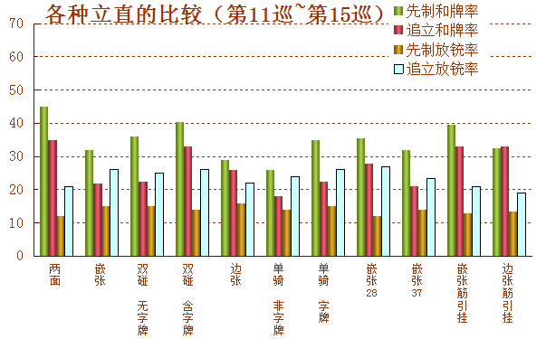

# 第二章 攻击的方法

　　本章从各方面解说麻将最重要的攻击。首先利用数据展示了先制攻击压倒的有利性。随着序盘、中盘、终盘等条件的变化进行了说明。点数与速度的兼顾、冷静的读牌等关键的部分希望大家掌握好。无论是麻将还是数据上都要先制攻击！

## **麻将就是要攻击！**

正如第一章所写，麻将就是由攻击与撤退（弃和）所构成的。这个局面是应该攻击呢？还是应该防守？这个才是关键。其他的技术与这个相比，其技术性要差很多。

作为其临界点的选择一般有2个。第一个是哪怕降低打点与听牌的宽度也要速攻（立直）；第二个就是降低速度重视打点与听牌的宽度。

攻击与撤退的关系。打点与速度的关系。麻将的战术就是要描绘出两者之间的平衡点。不过一般来说这是比较难的。笔者把比较重要的部分以前著《科学する麻雀》为基础，利用大量的数据与统计学、情报学等技术进行了科学的解释。在本书中以比较容易理解的结论形式展开更加详细化的正确的麻将战术。

在本书中，首先从应该直接进攻的情况开始讲述。

## **先制良形听牌应该立直！**

在比较平稳局面下，你有手牌A，听牌了。没有DORA，平和NOMI。这个牌应该立直吗？

**手牌A：**   
**自摸：**  **DORA：**

当平和NOMI（没有DORA，也没有三色或者一杯口等手役）听牌时，是否应该立直之前一直没有一个定说。

有些职业雀士写的战术书中说，门清听牌有一发和里宝牌的机会，不立直就太浪费机会了；但有些人却说把1000点的手牌变为2000点还要扔1000点棒子有点划不来。现在你如果到书店去，这两方面的言论的书籍你都可以找得到。

正确答案是，应该立直。

**这么说的理由是因为平和NOMI的的先制立直的平均和了得点大约是3500点**（严格来说的话，立直的平均得点随着巡目以及对手的进攻情况的不同而不同。正确的说法应该是“在某一巡的平均打点是3500点”）。假如我们进一个**比较极端的假设**，假设平和NOMI默听一定能够和牌，立直的话会是和牌率降低到35%（只考虑立直的收入的情况下）。**依旧是立直更加有利**。在从实际的情况来看，再考虑放铳率等等进行模拟测试，平和NOMI的手牌是非常适合立直的。

那么，手牌B又怎么样呢？这个牌只有立直NOMI。

**手牌B：**   
**自摸：** **DORA：**

这个答案也是一样的。立直NOMI的先制立直的平均得点大约是2500点。不立直的话就算有荣牌被打出也是不能荣和的，所以自然是应该立直的吧。顺便说一句，两面听牌的先制立直能与一发复合的概率，根据实际测量的基准来看，有近20%的概率呢。

**基本上良性的先制听牌即立是没有什么问题的**。这个原则对一些能够改良提高打点的手牌也基本是适用的。

为了便于大家参考，我把翻数与和牌的平均得点关系表放到了下面。1.5人进攻的意思是包括自己在内有1.5个人是全攻的状态（正确的说应该是一巡4张切牌，有1.5张是随机切出的，剩下的全是切的安全牌）。2人攻击的意思是他家有1个人处于立直状态，另外两人处于弃和状态。

               表1 第1巡 立直平均得点                            表2 第12巡 立直平均得点

     

从表2我们可以看出，在12巡，立直NOMI的手牌在2人全攻的状态下的平均得点是2530点。由于有一发和里宝牌的点数UP效果，立直NOMI的得点也够在2000点以上。拿出1000点去立直也是非常划算的了。


**所有良性先制听牌应该即立。**

**先制平和NOMI听牌应该即立。**

**先制良性听牌立直NOMI也应该即立。**


## 先制良形听牌不应该立直的条件

良形先制听牌基本上都应该即立，但是我在这里举几个不应该立直的例子吧。

首先，**默听能够有6翻（跳满）的手牌应该默听。**这样的手牌不应该立直来降低和牌率。一般情况下，在第13巡良形先制默听的话，和了率能有70%以上。要是立直的话，和了率会骤降到40%。和了率的降低程度随着对手的不同会出现一些误差，但只要没人跟你打配合牌，立直之后和牌率也不会超过60%。

那在来说说更加细节的地方。**默听有4翻（满贯）以上时，第4巡~第6巡后，其他3人打得比较稳的话（即有人立直会马上弃和），默听是正确的。**

另外，**默听有4翻以上时，第7巡~第9巡之后，其他3人中有2人打得比较稳的话，默听也是很有效率的。**

反过来，其他3人中有1.5人以上正在进攻的话，4翻以上的手牌立直也是一个不错的选择。

根据统计，有人立直的时候，其他3家切出的牌，每3张就有1张左右是危险牌。如果稍微单纯化一点看，也就是一个人在进攻，另外两个人在弃和。从立直自摸和牌的比例来判断，这个情况同样适用于任何巡目情况下。因此面对先制立直，有2人在进攻已经是非常激烈的攻击状态了。**在ALL LAST这种大家都会攻击的时候或者与不会弃和的对手打牌时，只要不是特别晚的巡目，满贯的手牌也是可以立直的。**


**良形先制听牌的话基本都应该即立。**

**例外就是默听有跳满以上、默听有满贯以上同时对手的防守很好的中巡之后应该默听。**


## **不要等待改良！**

即使是稍微改良一下就可以有高打点的手牌，两面先制听牌时也是不应该去改良的。比如手牌C和手牌D，等待改良是有损失的。

**手牌C：**  **DORA：**  
****

**手牌D：**  **DORA：**  

手牌C中已经包含了678的三色，但并没有完成这个手役。虽然有点可惜了，但是比起去摸  以及摸到  的DORA，立马立直才是更加有优势的。这里我们假设一巡之内能够把这牌做到满贯的概率为13.2%，而且还必须是良形听牌。为了改良而去平和NOMI默听（荣牌出来的话就和），与最初就平和立直相比，平均的收支的期望值两者其实几乎是一样的。**如果你的改良是特别有吸引力的话，改良会比较有利这假设其实也能够和即立不分上下。**

上级的雀士在有比较微妙的条件下有时候是会比较严格地区分“这里是不是需要等改良”，**但是如果没有明确的理由（比如ALL LAST必须要满贯才能够逆转等）都是应该即立的。**

手牌D摸到  的话能够附加断幺、三色以及一张DORA、一下子能够加4翻。由于是很好的改良，有些人害怕立直之后万一摸到  而不去立直。实际上一巡要摸到一张特定的牌的概率是3%左右，平均要34巡才能摸到一张特定的牌，等你摸到早都流局了。

为了方便大家参考，我把两面先制立直的图示给了出来（图1）

第一巡能够有85%的和牌率，到了第10巡就跌落到了60%。立直要是每晚一巡，其和牌率就会减少大概2.5%。这幅图描述的是到流局为止都是先制立直的情况。实际上如果有人追立的话，自己的优势地位会有一定程度的降低。

另外，**有一些人会在早巡听牌的之后的几巡“看看情况”再突然立直，这是非常有损失的！**用数学上的理由来说，**听牌之后和牌率最高的时候就是刚刚听牌的时候。**和牌的大半情况都是在听牌之后数巡之内。很多时候你还在“看情况”的时候荣牌就被打出来了。因此随着巡目的深入，你和牌的概率就在急剧地减少。

除非你能够很明确的知道你自己在听牌到立直这段时间内“到底是在观察什么、看什么情况”，否则这种打法是应该避免的。

等待改良和看看情况，就好像自己家里着火了不去想灭火的方法而是看看情况等着火蔓延一样。等你悠闲地搞清楚情况了，火已经大得不可能自然熄灭了。发现火的时候就浇水上去才是正确的做法。


**能改良为高打点的手牌，良形听牌也应该即立**

**你到底要观察什么样的情况呢？不要去无意义地“看情况”！**


## **马上就要流局时的良形先制是否立直？**

那么，还有2到3巡就要流局的情况，是不是不立直的好呢？

立直之后只有1300打点的手牌，为了避免不必要的送棒，还是以形式听牌为先吧。**但是立直之后有3900的打点还是比较划算的，立直有8000点（亲家7700点）的话，积极地立直才是正确的。**

终盘的立直，由于有人想要避免未听罚符，一巡之内危险牌要比通常情况更容易被打出。**即使剩下的巡目只有2巡，先制的良形立直和牌率的实际测量概率也有25%左右。**这是很让人吃惊的数据了。由于还有一定概率复合一发和海底等役，所以点数的加成是很大的。他家未听流局的概率也会比较大。**（根据实际测试，和牌时的一发概率占44%）**

“越是上级者在就要流局的时候面对立直一定会打得更小心吧？”。不不，这是不一定的。如果只需要打一张危险牌就可以在流局的时候听牌（甚至和牌），多数情况下这么打才是正确的。有时候就是应为采取了正确的打法才会放铳的。这些情况在实际测试时已经考虑过了。

有一定打点的手牌即使在终盘也应该立直。我们把这个结论反过来进行思考。如果是在序盘或者中盘，有一定打点的手牌的立直会更加有利。**良形先制听牌，只要打点不是特别的高，不管是什么巡目都是应该即立的。**大家可以把这个当做一个结论记住。

其实严密地进行一下思考，是否应该立直这个问题，其实就是立直所带来的打点提升与荣牌不容易打出以及要花费1000点棒这些优点与缺点之间的比较而已。

但是面对某个局面要去考虑那么复杂的事情是不现实的。因为打麻将的时候是没办法进行详细的计算的。

其实也不用详细的计算，事先分各种情况，把各种情况的对应结果与理论背下来是通向麻将正确道路的一条近路。应试数学里也有一种叫做“背诵数学”的应试技巧，在麻将中就可以叫做“背诵麻将”了吧。当然，运用能力才是最重要的。但是要能够运用，必须有一定的基础才行。仅仅靠灵光一现是无法应对所有可能出现的情况的。数学和麻将都不是那么单纯的哦。

一些稀有的例子除外，所有的良形先制听牌都应该立直。把这个当做结论记住才是正确的。


**即使是只剩下2次自摸的终盘，良形3~4翻的手牌就应该立直！**


## **愚型先制听牌基本都要立直**

那么嵌张、边张、普通的双碰听牌、非字牌的单骑听牌等非良性听牌又该怎么办呢？（在本书中，与两面听牌等相比，和牌率有明显差距的听牌形式都叫做“愚型”）。

除了立直的的打点提升与荣牌不容易被打出这两方面的比较之外，还要加入别的要素。那就是手牌的改良，比如嵌张变两面等等。

那我就先把结论给出来吧，**除非你这个愚型听牌的改良张数非常多或者巡目非常早，否则等待改良都是有损失的。**

**手牌E：**　**DORA：**

比如手牌E，摸到  可以提高打点。摸到 还可以使听牌变为良形听牌。但是一次摸牌摸到特定的牌的概率大概是3%，摸4种牌的概率就是12%。平均下来8巡左右可以摸到一次。花8巡的时间进行手牌的改良，其代价就是失去自己先制听牌的优势。这是划不来的，也是不应该的。

**手牌F：**  **DORA：**

手牌F的情况就更加简单了。摸到  可以变为两面听牌，而且还有平和。但是要在一巡之内摸到他们的概率是6%，平均要花16巡才能改良成功。

看看嵌张先制立直的图示（图2）我们就明白了。第一巡的立直有70%的和牌率，但是到了第10巡就降低到了45%。而且这还只是“先制立直”数值。要是还有其他人的进攻，这个数值还会更加低下


**只要不是改良的张数特别的多、巡目特别的早，愚型先制听牌也应该即立。**


## **不立直而应该“等待”的条件**

　　再来详细进行一下解说。和牌率与得点以及顺位综合来考虑，经过模拟测试我们得出了以下的条件。**这些都是非常重要的，想要变强的人一定要记住。**

●从第1巡的情况看，如果花个8~9巡能够让得点翻倍是值得的。另外，话5巡左右把愚形变为良形也是值得的。

●从第4巡的情况看，如果花个6~7巡能够让得点翻倍是值得的。愚形到良形的变化不能超过5巡。

●从第7巡的情况看，如果花个5~6巡能够让得点翻倍是值得的。愚形到良形的变化不能超过3巡。

●从第10巡的情况看，如果花个4巡能够让得点翻倍是值得的。愚形到良形的变化不能超过3巡。

●从第13巡的情况看，花3巡能够让得点翻倍是值得的。愚形到良形的变化不能超过2巡。

如果牌局才刚刚开始，提高打点或者改良听牌花点时间还是比较划算的，但是随着巡目到了中盘，对手听牌以及和牌的危险度渐渐增高，所以也就没有多余的功夫去改良了。所以，每次到这种情况的时候，把握“什么程度下有多划算”是非常重要的。

**手牌G：**  **DORA：**

那么来看看手牌G应该如何考虑吧。摸到  可以形成断幺的良形听牌，摸到  形成断幺的愚型听牌。

摸到7种牌其中1种的概率大致把握一下应该21%左右，平均5巡左右可以摸到。在来结合刚才的条件来看，这个牌在第7巡以前可以等待改良，第10巡之后就应该即立了。

但是，这个模拟测试的数据没有考虑放铳率，比起实战要更加单纯一点。这个牌其实在第6~7巡就已经可以即立了。


**根据上述不立直的条件，大家可以想想应该等待改良的例子吧。**


## **愚形立直的考虑方法**

“听牌之后等待改良”基本上都会绕远路。

**手牌H：**  **自摸：**  **DORA：**

在序盘，假如手牌G之前的手牌为手牌H，场上已经切出了2张  。这个时候就不应该切掉  听牌之后再等待改良，而是应该切掉  增加良形听牌的进张数。

反正都是比较难以和牌的形（形式听牌只在终盘必要的时候考虑），所以就最大限度地以能够和牌的形为目标吧。我们的目标是良形听牌，可是一旦听牌再想改良就会绕远路了。这就好像以考公务员为目标一样，一旦成为公务员之后你才发现“工资好低啊”。大家不要对号入座，不过发生这样的情况确实有点2了。

**手牌I：**

那么，**愚形先制有役听牌是否应该立直的基准就是手牌是否有3翻。**“默听只有2翻以下就立直，默听有3翻以上就继续默听”。当然，除了立直之外没有其他役的情况，没办法只好立直。不过这终究只是一种判断基准，根据我们的模拟，实际上这个基准与巡目和他家的进攻的概率有关系。从我们的基准来判断，手牌I如果没有DORA就应该立直，有1张以上的DORA就应该默听。


**不要在听牌之后再等待改良**

**2翻以下就立直，3翻以上就默听**


## **超级愚形听牌应该立直吗？**

那么在没有其他人立直的情况下，假设我们听半筋、两筋引挂都没有的嵌张  而且悲剧的是场上已经切出了2张  。这种听牌可以说是“超愚形”了。这种情况怎么办呢？

在中盘~终盘，根据之前说到的条件来判断（大概就是10~15巡左右），实际测量的立直和牌率是14.8%，而放铳率是19.1%。即使是在100万局中也只能找到162局左右的数据。虽然数据有所波动，但是还是可以看出来和牌是很困难的。

像这样不好的听牌，如果可以根据场上的状况来读出“其实还是比较容易和牌”的话，还是可以立直的。但是实际上真正能成为“超愚形听牌也要立直”的理由的，往往是“由于打点比较高，所以要立直”。（根据实际测试，超愚形立直中67%都是7700点以上）

果然这样的条件即使是先制听牌也不是那么有优势了。打点有8000也算勉强有点赚头（这种情况是可以进攻的）。如果只有2600的打点，那就不能进攻了。特别是亲家就更难以和牌了，考虑到连庄所带来的好处，即使3900的打点也是不能立直的。除非是终盘无论如何都要和牌或者DORA3以上等特殊的情况，否则以形式听牌为目标才是比较靠谱的。

另一方面，如果是在第5巡~第10巡，能够有比较快的立直情况就有所变化了。虽然还是有被追立然后放铳的可能，但是自己的和牌率能够有30%。有5200打点的手牌就能够赚头了。“超愚形”的话，本来是应该以改良为目标的。但是如果在听牌之前不小心搞成了超愚形的DORA2的手牌，在序盘（第7巡左右），改良比较困难的话还是可以立直的。

除了“超愚形”这种情况之外，其实“从自己的角度看，自己所听的牌还剩多少”并不怎么影响和牌率。所以也就不必太过在意自己所听的牌到底还剩多少。（当然特别极端的场合除外。）


**中盘~终盘的“超愚形”最少要8000点才能进攻**

**序盘的“超愚形”有5200打点，改良张数也比较少的可以立直。**


## **序盘~中盘的先制攻击到底多有利？**

在此之前都是在“先制立直”的情况进行了战术讲述。先制攻击是非常强力的手段，它占据了麻将技术的相当一部分。我们来看看数据吧，先制立直非常有利。图3是第6巡~第10巡立直的和牌率与放铳率。听牌形式以及先制立直、追立都分开进行了统计**。**

我们先来看先制立直的情况。最有利的情况就是两面立直了。和牌率最高，放铳率最低；紧接着是双碰听牌（含字牌），与两面听牌不相上下。两者都有着60%左右的和牌率与10%左右的放铳率。这确实是有着明显优势的，是最理想的状态。

边张听牌与嵌张听牌的和牌率有40%，放铳率有15%左右。除了特殊的情况之外，大家也都能够理解为什么嵌张与边张的先制听牌应该即立了吧。

再来看看追立的情况，数据有明显的下降。两面听牌的和牌率40%多一点，放铳率20%多一点。虽然立直是要有利一些，但是数字就差很多了。两面的追立与先制的嵌张、边张相比。和牌率差不多是一样，但是放铳率就要高一些了。也就是说，先制的嵌张、边张立直要比追立的两面有利。怎么样？大家是觉得有点吃惊还是觉得理所当然呢？

追立的嵌张、边张和牌率与放铳率基本是差不多的，有时候放铳率还比和牌率还要高。

## 中盘~终盘的先制攻击到底多有利 

图4是与图3同样内容但是是第11巡~第15巡的数据。由于立直的巡目晚了，所以各项数据都有所下降，但是各种立直的有利性的顺序并没有变化。先制两面立直的和牌率大约是45%、放铳率大约是12%，依旧是压倒性的优势。

有意思的是图3与图4之间的比较。早巡的嵌张立直与晚巡的两面立直哪一个更有利呢？我们通过两个图的比较明白到底是应该等待改良还是愚形也要即立。

图4中的两面立直的数据要比图3中的嵌张立直的数据要好一点，所以如果能把嵌张变为两面，拖延5巡再立直更好一点吧……这么说看似挺有道理，但实际上不是这样的。

首先，如果在这5巡之内有谁立直的话，自己立马就会失去先制听牌的有利地位；第二，途中可能有人和牌，所以说不定没有5巡之后；第三，要在5巡内把嵌张变为两面，除非是改良张数非常多的手牌。要在5巡内有这样的变化根本不能说是有利的。

**手牌J：**

因此，比如在第6巡的时候我们有手牌J听牌。就应该直接切  听嵌  先制立直。

但是，这里切掉  拒绝听牌，形成  与  的靠张一向听，摸到  和  可以完成一杯口、摸到  还可以向断幺前进。

要我评价说以上这种华丽（或者说是贪婪吧）的打法的话，那就是压倒性的不利。  与  的靠张一向听能形成两面只能够摸  三种牌，平均要花11巡的时间。把摸  完成一杯口的时间算进去平均也要花7巡的时间。所以说，这个牌切掉  即立才是正确的。

**推迟立直的巡目其中损失的要素除了降低和牌率之外，放铳率的增加也是不能忽视的。**早早立直不但和牌的机会更多，和牌率增加，单纯的来说放铳率也会降低。再者，立直还有威慑的效果，就能更进一步的降低放铳率。

先制攻击就是能将和牌率最大化、降低放铳率的有效手段。希望大家都能够体会到。


**第6巡的嵌张立直比第11巡的两面立直更有利。**


## “良形”与“愚形”到底是什么？

从先前的图3与图4可以看出各种听牌形式的优秀程度。**按照顺序来说就是，两面、双碰（字牌）、单骑（字牌）、筋牌引挂的边张、双碰（无字牌）、筋牌引挂的嵌张。**

引挂的嵌张与边张要依靠自己的舍牌，有人追立的话情况就大不一样了。**因此纯粹的良形听牌就是两面、双碰（字牌）、单骑（字牌）3种。**在本章开始所说的良形与愚形就是指的这个。

两面是最好的听牌形式，这个都是常识了。但是一般情况下，大家都还没有把字牌双碰和字牌单骑当做良形听牌吧。

那么，要说两面听牌占据立直中的比例，先制立直占据65%、追立占据63%。而且，**基本上早巡的立直很多情况下都是两面。**虽然有“早巡的立直形状应该还没有那么整齐”的说法，但实际上正好相反。正是因为早巡，所以把愚形改为良形的时间还是有的。从结果上来看，根据统计的“早巡立直”还是良形听牌较多。

**两面、双碰（字牌）、单骑（字牌）这3种听牌形式总共占据了所有立直的70%~80%（随着巡目有一定偏差）。**大家也都可以明白了吧，立直果然是很可怕的。


**良形听牌就是两面、字牌双碰、字牌单骑这3种听牌。**


## “良形低打点”VS“愚形高打点”

良形低打点的手牌与愚形高打点的手牌我们应该选择哪个呢？

**手牌K：**  ****  ****  ****  **DORA：**

**手牌L：**  ****  ****  **DORA：**

比如我们在手牌K听牌的时候摸到了  。是摸切  维持两面听牌呢？还是切掉  选择对对呢？

或者手牌L听牌的时候摸到了DORA的  ，是摸切  维持两面听牌呢？还是切掉  选择DORA2呢？（如果和  的话就是DORA3）

这种时候，把两面听牌变为双碰听牌，将8张的听牌变为4张，并不意味和牌率就会减半。这与抽中奖率只有50%的奖、如果去抽的次数越多，你的中奖几率是会大于50%是同一个道理。**仅仅抽一张牌的和牌率是减半了，但是总的和牌率还是要比两面的和牌率的一半要高。**

因此，只要**不是**有人立直需要速速和牌、即使打点低也要优先和牌（比如ALL LAST或者ALL LAST前一局的大TOP等）或者是所听的牌确实很糟糕等**特殊情况。即使是愚形听牌，选择能让得点翻倍才是更有利的。**

但是，把3900点变为5200点并不是非常有效率，所以不推荐。另外，是否应该把5200点变为8000点、或者把8000点变为12000这种情况的判断是很微妙的。在终盘一般情况下是选择良形会比较有利一些。但由于判断的因素很复杂，如果没有什么基准的话就随便打一张也OK（随着直觉打）。


**即使是变为愚形也并不意味着和牌率会减半**

**如果能让打点翻倍，基本上都是愚形更加有利**


## **立直与立直、立直与默听如何比较？**

副露的手牌，满贯以下没增加1翻其点数就会单纯的翻倍。因此对于“良形低打点还是愚形高打点”的判断是很简单的。但是需要立直的情况下就非常复杂了。我先说说结论，**30符2翻（2000点）以下的两面手牌，能提升一翻就选择愚形；3翻以上的手牌一律都选择良形。**

**手牌M：**  **DORA：**

比如手牌M，与其切掉  选择两面立直，切掉  选择嵌张的三色要更好。如果手牌里有一张DORA的话（假如DORA是  ），这个时候与其选择嵌张听牌，还是两面更好。

那么两面立直与嵌张默听之间的比较又如何呢？

**手牌N：**   **DORA：**

大家看手牌N，我们来讨论一下是切掉  选择门断平DORA1更好呢？还是切  默听选择断幺三色DORA1更好呢？

我们把情况假设为默听的话其他三人会没有警戒，立直的话就只有一个人对攻这种标准的形式吧。在这个情况下，两者的和牌容易程度基本是一样的。

如果是已经有一人立直，另外两人已经弃和。这种情况即使是默听（假设我们没有听立直家的现物），6M也不是那么容易被打出来的。所以这种情况还是选择良形的立直来应对吧。

这样的手牌立直，有一定的几率成为跳满，至少也是个满贯。默听的话就是满贯。由于两者和牌率差不多，所以是应该选择点数更高的良形立直。

**请大家记住，在没有其他攻击的情况下，“愚形默听的和牌率≈良形立直的和牌率”。**


**2000点以下的手牌能提高1翻选择愚形、3翻以上的牌选择良形。**

**愚形默听的和牌率≈良形立直的和牌率**


## **见逃低目真的没问题吗？**

**手牌O：**

比如手牌O听牌立直。高目  和牌就是满贯，那么低目的  被打出的时候该怎么办呢？

荣牌被打出的时候是否和牌的判断，其实就是见逃时候的收入期望值是否大于和牌的收入（期望值）。

**立直的时候我都是建议和牌。**比如这个时候是第10巡，如果见逃（也就是会进入振听状态），加上他家的进攻来考虑，其期望值也就比1000点高出一点点而已。这比立直NOMI（没有一发）的期望值都还要低。如果有一发的话，立直平和的手牌已经很不错了，应该见逃的情况几乎是没有的。

**手牌P：**  **** **** ****  **DORA：**  

那如果是像手牌P那样的默听呢？高目是满贯（东全带三色DORA1），低目只有2000点（东DORA1）

与立直的情况不同，默听与副露状态下的一个优点就是即使见逃，只要等一巡之后就可以解除振听。第10巡的先制良形默听，其和牌率在80%左右。一半几率是满贯，一半几率是2000点的话，平均就是5000点\*0.8=4000点的收入期望。因此，在第10巡低目的荣牌打出时，见逃就是正确的了。当然，如果是在ALL LAST自己且TOP的话当然无论什么都要和牌了。

**像这样的副露高目为满贯的手牌，见逃低目的荣牌通常都是正确的。**如果巡目尚浅就积极地见逃吧。就刚才那个例子来说，如果低目的荣牌打出的同巡上家打出了高目荣牌，应该吃，然后换雀头听牌。第10巡先制听牌，愚形有60%左右，这个时候是应该把打点固定到8000点的。


**立直的时候见逃低目有损失**

**副露或者默听的手牌，见逃低目的2000点选择高目满贯是正确的战略**


## 听DORA是正确的吗？

霸气听DORA与选择其他低调一点的听牌哪一个是正确的呢？我们来谈论一下单骑以及嵌张听不容易被打出的DORA是否会不利吧。

根据我们的实际测试，在一个比较平均的巡目下，先制的嵌张、双碰听DORA立直和牌率在40%左右。无筋456的DORA单骑和牌率在20%左右。不管怎样，非DORA的听牌和牌率也就60%左右，由于DORA能够让得点翻倍（有时候能够4倍），所以这意味着听DORA是十分有利的。

**手牌Q：** **** **** ****  **DORA：**

**手牌R：**  **DORA：**

那么手牌Q切掉5M听DORA是正确的。手牌R的立直也是正确的。

考虑到手牌R不太容易和出，等着摸  或者  形成两面平和，或者摸  形成多面张是不利的。虽然这是降低打点扩大听牌宽度的行为，但是话时间去改良也是没用的。本来DORA单骑就要比两面有利，这里也不用考虑摸  和  的有点了。DORA单骑，就决定是你了！

**手牌S：**  **DORA：**

但是如果手牌R之前的手牌是手牌S的话，切掉  立直要比切掉  立直更有利。

另外，把役牌混一色做成役牌混一色DORA2这种5200点→8000点的变化时，听DORA会使听牌恶化（比如4S单骑什么的），这种情况就多半是不利的了。特别是混一色听DORA就更不容易被打出了。

一般情况下，听DORA的确是不容易被打出的。但是作为这个缺点的弥补就是DORA对打点的加成了。即使手牌能够改良，只要不是特别差得听牌，听DORA是不错的选择。和牌率只要有40%，即使是与很好的听牌相比，依旧是得点能够倍增的影响更大一些。果然还是霸气比低调更有利的情况更多呢。

当然也有不听DORA更好的例子，比如现在是TOP，和牌率比打点更加优先的时候就不要听DORA了。


**霸气听DORA胜过低调听牌的情况要多一些**

**能够使点数翻倍的情况下听DORA有优势**

**为了把5200点→8000点选择听DORA的愚形是不利的**


## **振听了应该立直吗？**

振听立直怎么样？

先制立直的情况下，**振听三面与普通的两面相比，还是普通的两面有利一点。但是愚形听牌与振听两面相比，两者的和牌率基本没什么差别。**普通的振听良形听牌与愚形差不多，**所以相同点数的情况下，与其选择嵌张，振听三面才是正确的。**

虽然尽力不振听是最好的，但是即使按照最正确的方式打牌有时候也还是会振听的。到了那个时候所面临的选择是该振听立直呢？还是选择宽度更小的听牌呢？或者还是等待改良消除振听呢？还是默听？还是干脆拒听呢？

这种微妙的选择，还有很多部分没有一个定论。但是能够确定的一点就是，默听几乎是没有好处的。要么就是直接振听立直，如果要改良的话最多只能拒听一次。


**愚形立直与振听良形基本是一样的**

**振听三面比愚形听牌要优秀一些**


## 七对子（或者单骑听牌）应该立直吗？

这一节我们来讨论一下雀头听牌时是立直还是默听的问题。首先，默听有6400点以上（七对子DORA2等）时，与“愚形立直的考虑方法”那一节所写的一样，默听就OK。另外，从“良形听牌都要即立”这个原则来看，字牌单骑立直也是不错的选择。

那么一般的七对子，比如听无筋的  时，是否应该立直呢？**有关愚形先制的七对子是否需要即立的问题，我做了如下总结。**

**1.4翻以上的情况，默听**

**2.断幺七对子的情况下，立直（没有什么特别好的换听材料时）**

**3.七对子NOMI且是序盘，默听（即使荣牌打出也不和）**

**4.七对子NOMI的终盘（第7~第10巡），微妙的情况（立直默听都可以）**

**5.七对子NOMI的终盘（第15巡之前），立直**

不仅仅是七对子，听雀头的牌都可以以这个为基准。第7巡~第10巡听牌的时候，能否在3巡只能改良是判断的重要基准。

1巡之内要有33%的改良概率，也就是要11种进张就可以了。 比如手牌T，摸到  以及剩下的字牌都可以改良为良形听牌。改良进张十分多，估计2~3巡就可以改良成功了，所以这里等待改良是正确的。

门清状态有两个顺子以上的情况，能够改良的进张在11种以上的情况是比较多的。因为一个顺子就有4种进张，再加上字牌的变化。通常这种情况就是可以等待改良的。特别是在序盘以及有平和可能性的情况。**因此除了终盘之外的大多数情况下，听雀头的手牌等待改良也是一个不错的选择。**


**4翻以上的七对子默听**

**断幺七对子要立直**

**序盘的七对子NOMI要等待一个好的听牌**

**第10~第15巡的七对子NOMI要立直**

**单骑听牌变化很多，所以可以等待改良**


## 应该拿着安全牌还是应该最大限度的扩大自己的手牌？

**手牌U：**  **自摸：**  

一向听的时候，我们有时候会有“是应该留安全牌还是最大限度地扩大手牌进张”的问题。比如手牌U，切掉  可以留下安全牌的  ；切  的话，就可以形成摸到  和  也能听牌的“完全一向听”。

像这样的情况，摸切  扩大手牌进张要更好一些。留下  可能面对他家的先制立直时有切一张危险牌的可能性。我们这个牌一巡之内听牌的概率大概为14.6%，与其他三人一巡之内听牌的概率相比还是要高很多。而且留的那一张牌是否真的能成为危险牌也是不确定的。因此，扩大进张数的优势要更大一些。

**手牌V：**  **自摸：**

手牌V，万子的  与  的进张是同一条筋上的牌。留下  可以在摸到  或者  时改良手牌。但是这么做对和牌率的提升与中巡之后（第12巡左右）  成为危险牌的可能性相比还是很微妙的。当然，要是摸到  的话就直接把  切掉吧。


**与其留下安全牌，进入完全一向听更有利**


## **要鸣牌提前听牌吗？**

**手牌W：**

手牌W的一向听，要是有人打出  的话，碰了就是1000点听牌。这种情况下是应该碰还是应该等门清听牌立直呢？

就这个例子来说，1巡14%的概率能够门清听牌40符2翻与100%断幺NOMI听牌（他家的警戒要比立直低一些）之间的比较。

非常微妙的判断，根据我们的模拟数据来看，序盘门清有利，8巡之后碰听比较有利。

但是，先暂时不碰凹门清，要是发现再继续凹门清会不利再转转向食断也是常有的事情。实际上稍微把眼光放远一点凹门清也是很不错的。

另外，**把亲家的连庄换算成点数的话，大概有650点的价值。**这个值随着规则的变化有所变动。不过常常有不断“自己是亲家”、“自己是亲家”这样暗示自己而去猛攻的雀士。“即使不放铳连庄也就只有650点而已”（场上的立直棒只有1根以下时）。也不要太把亲家的连庄神圣化了。

**手牌X：** 

像手牌X这样的愚形又该如何呢？门清听牌的进张就要变得窄很多了（一巡也就8.8%的概率）。这样平均要花上10巡左右才能够听牌。考虑到他家的进攻，“第10巡~第11巡之后与其等待高打点的门清，不如现在就听牌”，这个要明显有利一些（不考虑改良的可能性，毕竟这个牌改良的张数也不多）。

有关改良的问题，我们曾经有过“从第几巡的情况看，能够让点数翻倍最多能够拖延几巡”的说法。这个方法用于判断是否碰听也是适用的。

**“门清的两面十分形，在序盘（第6巡以前）不用急于碰听**（自己是亲家的话，碰听会稍稍有利那么一点点）”；**如果是比较迟的中盘~终盘（第10巡~第12巡以后）就不要拘泥于打点，即使是低打点也要积极碰听。**

**手牌W：**  **DORA：**

以上的标准对于碰听3900点，门清满贯打点的手牌也是适用的。先前的手牌Y，如果  是DORA的话（手牌Y），那么在第6巡以前不用着急听牌，第10巡~第12巡之后速速听牌才是比较有利的。

另外，**如果碰听都能满贯，立直又没有什么特别大的作用时，很明显就是碰听有利了。**


**两面的十分形，第6巡以前没必要急于碰听（亲家可以速度一点），第10巡~第12巡之后应该鸣牌听牌。**


（待续……）  

